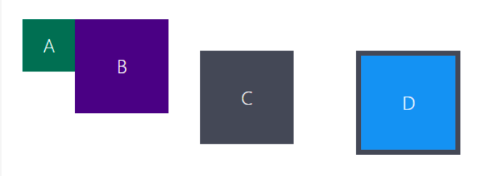

# Exercício de Fixação: box model

Neste exercício foram exercitadas conceitos usados para a estilização do layout de caixas no CSS. As propriedades usadas foram **height**, **width**, **padding**, **margin** e **border**.

Abaixo está figura do layout final:

